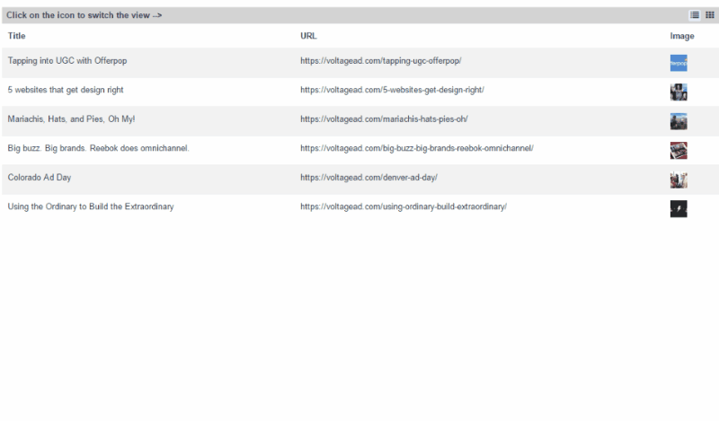

# vue-list-grid

> Vue.js List + Grid Component

Allows you to switch between list and grid view of the given data. You can use any `list` and `grid` controls of your choice to render the actual views.

## Build Setup

You can clone or download this project and follow the below steps to run and test this demo app.
``` bash
# install dependencies
npm install

# serve with hot reload at localhost:8080
npm run dev

# build for production with minification
npm run build
```

## Usage

Add the `listGrid.vue` component (located in the `src/components/` folder) to your project and import it using

````
<script>
 import listGrid from './listGrid'
 export default {
   components: {
    listGrid, 
  }
 }
</script>
````

In your template use the `listGrid` component as below

````
<listGrid view='list' 
          :data=listGridData 
          :listRenderer=listRenderer 
          :gridRenderer=gridRenderer 
          caption="The Caption">
</listGrid>
````
where the `listRenderer` and `gridRenderer` are the list and grid components of your choice. 

For example, you can use `bootstrap-vue` to construct these components yourself (as done in this test app), or use any other Vue2 based component libraries, such as 
 - [element UI](https://github.com/ElemeFE/element)
 - [Vue-Beauty](https://github.com/FE-Driver/vue-beauty)
 - [iView](https://github.com/iview/iview)
 
 ## Preview
 
